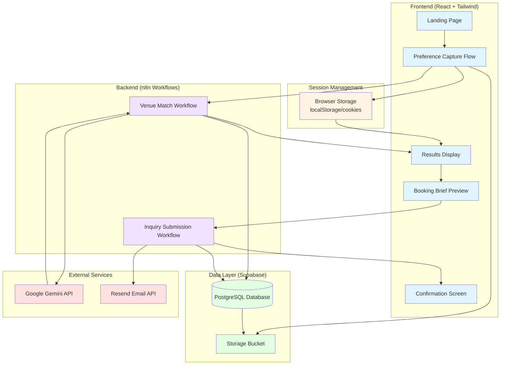

# Design Document: Wedding Venue Recommendation Tool

## Overview

The Wedding Venue Recommendation Tool is a serverless, AI-driven web application that streamlines wedding venue discovery and inquiry. The architecture follows a modern JAMstack pattern with a React frontend, n8n workflow orchestration backend, Supabase for data persistence, and Google Gemini for AI-powered venue matching.

The system operates without user authentication, using session-based state management to provide a frictionless experience. Couples describe their wedding vision through a guided multi-step form, and the AI matches their preferences against a curated venue database to recommend 1-3 best-fit options. Once a venue is selected, the system auto-generates and sends a professional booking brief via email.

### Key Design Principles

1. **Frictionless UX**: No accounts, no lengthy forms, mobile-first design
2. **AI-Driven Intelligence**: Semantic matching beyond simple filters
3. **Session-Based State**: Temporary persistence without authentication overhead
4. **Workflow Orchestration**: n8n handles all backend logic, integrations, and AI calls
5. **Fail-Safe Operations**: Graceful degradation and clear error communication

## Architecture

### System Architecture Diagram



### Technology Stack Rationale

- **React + Tailwind CSS**: Component-based UI with utility-first styling for rapid development and mobile responsiveness
- **AWS S3 + CloudFront / Amplify**: Static hosting with global CDN for fast page loads
- **n8n**: Visual workflow builder that eliminates custom backend code while providing robust orchestration, error handling, and integration capabilities
- **Supabase**: Managed PostgreSQL with built-in storage, real-time capabilities, and generous free tier
- **Google Gemini API**: Advanced language model for semantic venue matching and reasoning generation
- **Resend**: Modern transactional email API with excellent deliverability

## Components and Interfaces

### Frontend Components

#### 1. Landing Page Component
**Purpose**: Communicate value proposition and initiate user journey

**Props**: None

**State**: None

**Key Methods**:
- `handleStartClick()`: Initializes session and navigates to preference capture

**UI Elements**:
- Hero section with value proposition
- Call-to-action button
- Trust indicators (no account required, AI-powered)

---

#### 2. Preference Capture Component
**Purpose**: Guide couples through stepped input flow

**Props**:
- `sessionId: string` - UUID for session tracking

**State**:
- `currentStep: number` - Current step in the flow (0-6)
- `preferences: PreferenceSet` - Accumulated preference data
- `validationErrors: Record<string, string>` - Field-level validation messages

**Key Methods**:
- `handleNext()`: Validates current step and advances
- `handleBack()`: Returns to previous step
- `handleSubmit()`: Sends preferences to n8n webhook
- `validateStep(stepIndex: number): boolean` - Validates current step inputs
- `uploadImage(file: File): Promise<string>` - Uploads inspiration image to Supabase Storage

**Steps**:
1. Date selection (single date or range)
2. Guest count (number input)
3. Budget range (slider with predefined brackets)
4. Style/vibe (dropdown + free text)
5. Location (text input with optional autocomplete)
6. Inspiration images (optional file upload)
7. Review summary

**Data Structure**:
```typescript
interface PreferenceSet {
  sessionId: string;
  dateStart: Date | null;
  dateEnd: Date | null;
  guestCount: number;
  budgetMin: number;
  budgetMax: number;
  styleOptions: string[];
  styleDescription: string;
  location: string;
  inspirationImageUrls: string[];
}
```

---

#### 3. Results Display Component
**Purpose**: Show AI-ranked venue recommendations

**Props**:
- `sessionId: string`
- `venues: VenueMatch[]`

**State**:
- `selectedVenue: VenueMatch | null`
- `isLoading: boolean`

**Key Methods**:
- `handleVenueSelect(venueId: string)`: Navigates to booking brief preview
- `handleAdjustPreferences()`: Returns to preference capture with pre-filled data

**Data Structure**:
```typescript
interface VenueMatch {
  venueId: string;
  name: string;
  location: string;
  capacityMin: number;
  capacityMax: number;
  priceMin: number;
  priceMax: number;
  imageUrls: string[];
  amenities: string[];
  matchScore: number;
  matchReasoning: string;
}
```

---

#### 4. Booking Brief Preview Component
**Purpose**: Display auto-generated booking brief before sending

**Props**:
- `sessionId: string`
- `venue: VenueMatch`
- `preferences: PreferenceSet`

**State**:
- `bookingBrief: BookingBrief`
- `coupleEmail: string` - Optional email for copy
- `isSending: boolean`

**Key Methods**:
- `generateBrief()`: Creates structured booking brief from preferences
- `handleSendInquiry()`: Triggers n8n inquiry workflow
- `handleEditPreferences()`: Returns to preference capture

**Data Structure**:
```typescript
interface BookingBrief {
  venueName: string;
  venueEmail: string;
  dateRange: string;
  guestCount: number;
  budget: string;
  style: string;
  location: string;
  additionalNotes: string;
  timestamp: Date;
}
```

---

#### 5. Confirmation Screen Component
**Purpose**: Confirm successful inquiry submission

**Props**:
- `venue: VenueMatch`
- `bookingBrief: BookingBrief`
- `coupleEmail: string | null`

**State**: None

**Key Methods**:
- `handleSearchAgain()`: Resets session and returns to landing page

---

### Backend Workflows (n8n)

#### Workflow 1: Venue Match Workflow

**Trigger**: Webhook (POST /api/match-venues)

**Input Payload**:
```json
{
  "sessionId": "uuid",
  "preferences": {
    "dateStart": "2024-12-01",
    "dateEnd": "2024-12-01",
    "guestCount": 150,
    "budgetMin": 5000,
    "budgetMax": 10000,
    "styleOptions": ["rustic", "outdoor"],
    "styleDescription": "Barn wedding with string lights",
    "location": "Austin, TX",
    "inspirationImageUrls": ["https://..."]
  }
}
```

**Workflow Steps**:
1. **Validate Input**: Check required fields
2. **Query Supabase**: Filter venues by capacity, budget, location
3. **Prepare AI Prompt**: Format candidate venues and preferences for Gemini
4. **Call Gemini API**: Request semantic ranking and reasoning
5. **Parse AI Response**: Extract top 1-3 venues with scores and reasoning
6. **Store Session Data**: Save preferences and results to Supabase
7. **Return Response**: Send ranked venues to frontend

**Output Payload**:
```json
{
  "sessionId": "uuid",
  "venues": [
    {
      "venueId": "venue-123",
      "name": "Rustic Barn Estate",
      "location": "Austin, TX",
      "capacityMin": 100,
      "capacityMax": 200,
      "priceMin": 6000,
      "priceMax": 9000,
      "imageUrls": ["https://..."],
      "amenities": ["outdoor ceremony", "string lights", "parking"],
      "matchScore": 0.95,
      "matchReasoning": "This venue perfectly matches your rustic outdoor vision..."
    }
  ]
}
```

**Error Handling**:
- Database query failure → Return 500 with retry message
- No candidates found → Return 200 with empty array and suggestion message
- Gemini API timeout → Retry 3 times, then return 503
- Invalid input → Return 400 with validation errors

---

#### Workflow 2: Inquiry Submission Workflow

**Trigger**: Webhook (POST /api/submit-inquiry)

**Input Payload**:
```json
{
  "sessionId": "uuid",
  "venueId": "venue-123",
  "bookingBrief": {
    "venueName": "Rustic Barn Estate",
    "venueEmail": "bookings@rusticbarn.com",
    "dateRange": "December 1, 2024",
    "guestCount": 150,
    "budget": "$5,000 - $10,000",
    "style": "Rustic outdoor with string lights",
    "location": "Austin, TX",
    "additionalNotes": "Looking for a barn setting with outdoor ceremony space"
  },
  "coupleEmail": "couple@example.com"
}
```

**Workflow Steps**:
1. **Validate Input**: Check required fields
2. **Format Email Template**: Populate booking brief template
3. **Send to Venue**: Call Resend API to send email to venue
4. **Send Copy to Couple** (if email provided): Call Resend API
5. **Log Inquiry**: Store inquiry record in Supabase
6. **Return Confirmation**: Send success response to frontend

**Output Payload**:
```json
{
  "success": true,
  "inquiryId": "inquiry-456",
  "timestamp": "2024-01-15T10:30:00Z",
  "venueName": "Rustic Barn Estate",
  "coupleCopySent": true
}
```

**Error Handling**:
- Resend API failure → Retry 3 times, then return 503
- Invalid venue email → Return 400 with error message
- Database logging failure → Log error but still return success to user

---

### Database Schema (Supabase)

#### Table: sessions
```sql
CREATE TABLE sessions (
  id UUID PRIMARY KEY DEFAULT uuid_generate_v4(),
  session_token UUID UNIQUE NOT NULL,
  created_at TIMESTAMP WITH TIME ZONE DEFAULT NOW(),
  last_activity TIMESTAMP WITH TIME ZONE DEFAULT NOW(),
  expires_at TIMESTAMP WITH TIME ZONE DEFAULT NOW() + INTERVAL '7 days'
);

CREATE INDEX idx_sessions_token ON sessions(session_token);
CREATE INDEX idx_sessions_expires ON sessions(expires_at);
```

#### Table: preferences
```sql
CREATE TABLE preferences (
  id UUID PRIMARY KEY DEFAULT uuid_generate_v4(),
  session_id UUID REFERENCES sessions(id) ON DELETE CASCADE,
  date_start DATE,
  date_end DATE,
  guest_count INTEGER NOT NULL,
  budget_min INTEGER NOT NULL,
  budget_max INTEGER NOT NULL,
  style_options TEXT[],
  style_description TEXT,
  location TEXT NOT NULL,
  inspiration_image_urls TEXT[],
  created_at TIMESTAMP WITH TIME ZONE DEFAULT NOW(),
  updated_at TIMESTAMP WITH TIME ZONE DEFAULT NOW()
);

CREATE INDEX idx_preferences_session ON preferences(session_id);
```

#### Table: venues
```sql
CREATE TABLE venues (
  id UUID PRIMARY KEY DEFAULT uuid_generate_v4(),
  name TEXT NOT NULL,
  email TEXT NOT NULL,
  location TEXT NOT NULL,
  latitude DECIMAL(10, 8),
  longitude DECIMAL(11, 8),
  capacity_min INTEGER NOT NULL,
  capacity_max INTEGER NOT NULL,
  price_min INTEGER NOT NULL,
  price_max INTEGER NOT NULL,
  style_tags TEXT[],
  amenities TEXT[],
  description TEXT,
  image_urls TEXT[],
  created_at TIMESTAMP WITH TIME ZONE DEFAULT NOW(),
  updated_at TIMESTAMP WITH TIME ZONE DEFAULT NOW()
);

CREATE INDEX idx_venues_location ON venues(location);
CREATE INDEX idx_venues_capacity ON venues(capacity_min, capacity_max);
CREATE INDEX idx_venues_price ON venues(price_min, price_max);
CREATE INDEX idx_venues_style ON venues USING GIN(style_tags);
```

#### Table: inquiries
```sql
CREATE TABLE inquiries (
  id UUID PRIMARY KEY DEFAULT uuid_generate_v4(),
  session_id UUID REFERENCES sessions(id) ON DELETE SET NULL,
  venue_id UUID REFERENCES venues(id) ON DELETE SET NULL,
  booking_brief_content JSONB NOT NULL,
  couple_email TEXT,
  status TEXT DEFAULT 'sent',
  created_at TIMESTAMP WITH TIME ZONE DEFAULT NOW()
);

CREATE INDEX idx_inquiries_session ON inquiries(session_id);
CREATE INDEX idx_inquiries_venue ON inquiries(venue_id);
CREATE INDEX idx_inquiries_created ON inquiries(created_at);
```

#### Storage Bucket: inspiration-images
- Public read access
- Authenticated write access (via service key from n8n)
- File size limit: 5MB per image
- Allowed formats: JPEG, PNG, WebP
- Path structure: `{sessionId}/{timestamp}-{filename}`

---

### Session Management

#### Session Lifecycle

1. **Creation**: When user starts preference capture
   - Generate UUID v4 token
   - Store in localStorage as `wvrt_session_token`
   - Create session record in Supabase
   - Set expiration to 7 days from creation

2. **Persistence**: Throughout user journey
   - Include session token in all API requests
   - Update `last_activity` timestamp on each interaction
   - Store preferences and results associated with session

3. **Retrieval**: When user returns
   - Check localStorage for existing token
   - Validate token hasn't expired
   - Fetch associated preferences and results
   - Resume from last state

4. **Expiration**: After 7 days of inactivity
   - Automated cleanup job removes expired sessions
   - Associated preferences and inquiry logs remain for analytics

#### Session Token Format
```typescript
interface SessionToken {
  token: string; // UUID v4
  createdAt: number; // Unix timestamp
  expiresAt: number; // Unix timestamp
}
```

#### Session Storage Implementation
```typescript
class SessionManager {
  private static STORAGE_KEY = 'wvrt_session_token';
  private static EXPIRY_DAYS = 7;

  static createSession(): string {
    const token = crypto.randomUUID();
    const now = Date.now();
    const expiresAt = now + (this.EXPIRY_DAYS * 24 * 60 * 60 * 1000);
    
    const sessionData: SessionToken = {
      token,
      createdAt: now,
      expiresAt
    };
    
    localStorage.setItem(this.STORAGE_KEY, JSON.stringify(sessionData));
    return token;
  }

  static getSession(): string | null {
    const stored = localStorage.getItem(this.STORAGE_KEY);
    if (!stored) return null;
    
    const sessionData: SessionToken = JSON.parse(stored);
    if (Date.now() > sessionData.expiresAt) {
      this.clearSession();
      return null;
    }
    
    return sessionData.token;
  }

  static clearSession(): void {
    localStorage.removeItem(this.STORAGE_KEY);
  }
}
```

## Data Models

### Frontend Data Models

```typescript
// Core preference data structure
interface PreferenceSet {
  sessionId: string;
  dateStart: Date | null;
  dateEnd: Date | null;
  guestCount: number;
  budgetMin: number;
  budgetMax: number;
  styleOptions: string[];
  styleDescription: string;
  location: string;
  inspirationImageUrls: string[];
}

// Venue match result from AI
interface VenueMatch {
  venueId: string;
  name: string;
  location: string;
  capacityMin: number;
  capacityMax: number;
  priceMin: number;
  priceMax: number;
  imageUrls: string[];
  amenities: string[];
  matchScore: number; // 0.0 to 1.0
  matchReasoning: string;
}

// Booking brief for inquiry
interface BookingBrief {
  venueName: string;
  venueEmail: string;
  dateRange: string;
  guestCount: number;
  budget: string;
  style: string;
  location: string;
  additionalNotes: string;
  timestamp: Date;
}

// API response types
interface MatchVenuesResponse {
  sessionId: string;
  venues: VenueMatch[];
  message?: string; // For "no results" case
}

interface SubmitInquiryResponse {
  success: boolean;
  inquiryId: string;
  timestamp: string;
  venueName: string;
  coupleCopySent: boolean;
}

// Error response
interface ErrorResponse {
  error: string;
  message: string;
  retryable: boolean;
}
```

### AI Prompt Structure

#### Venue Matching Prompt Template

```
You are an expert wedding venue consultant. A couple is searching for their perfect wedding venue.

COUPLE'S PREFERENCES:
- Wedding Date: {dateRange}
- Guest Count: {guestCount}
- Budget: ${budgetMin} - ${budgetMax}
- Style/Vibe: {styleOptions} - {styleDescription}
- Location: {location}
- Inspiration: {inspirationImageDescription}

CANDIDATE VENUES:
{candidateVenuesJSON}

TASK:
Rank the top 1-3 venues that best match this couple's vision. For each recommended venue, provide:
1. A match score (0.0 to 1.0)
2. Plain-language reasoning (2-3 sentences) explaining why this venue fits their preferences

Consider:
- How well the venue's style aligns with their vision
- Whether capacity and budget are appropriate
- Location convenience
- Unique features that match their inspiration

Return your response as JSON:
{
  "recommendations": [
    {
      "venueId": "string",
      "matchScore": number,
      "reasoning": "string"
    }
  ]
}
```

### Email Template Structure

#### Booking Brief Email Template

```html
<!DOCTYPE html>
<html>
<head>
  <meta charset="UTF-8">
  <title>Wedding Venue Inquiry</title>
</head>
<body style="font-family: Arial, sans-serif; line-height: 1.6; color: #333;">
  <div style="max-width: 600px; margin: 0 auto; padding: 20px;">
    <h2 style="color: #2c3e50;">New Wedding Venue Inquiry</h2>
    
    <p>Hello {venueName} team,</p>
    
    <p>A couple is interested in booking your venue for their wedding. Here are the details:</p>
    
    <table style="width: 100%; border-collapse: collapse; margin: 20px 0;">
      <tr style="background-color: #f8f9fa;">
        <td style="padding: 10px; border: 1px solid #dee2e6;"><strong>Wedding Date</strong></td>
        <td style="padding: 10px; border: 1px solid #dee2e6;">{dateRange}</td>
      </tr>
      <tr>
        <td style="padding: 10px; border: 1px solid #dee2e6;"><strong>Guest Count</strong></td>
        <td style="padding: 10px; border: 1px solid #dee2e6;">{guestCount} guests</td>
      </tr>
      <tr style="background-color: #f8f9fa;">
        <td style="padding: 10px; border: 1px solid #dee2e6;"><strong>Budget Range</strong></td>
        <td style="padding: 10px; border: 1px solid #dee2e6;">{budget}</td>
      </tr>
      <tr>
        <td style="padding: 10px; border: 1px solid #dee2e6;"><strong>Style Preference</strong></td>
        <td style="padding: 10px; border: 1px solid #dee2e6;">{style}</td>
      </tr>
      <tr style="background-color: #f8f9fa;">
        <td style="padding: 10px; border: 1px solid #dee2e6;"><strong>Location</strong></td>
        <td style="padding: 10px; border: 1px solid #dee2e6;">{location}</td>
      </tr>
    </table>
    
    <div style="background-color: #f8f9fa; padding: 15px; border-left: 4px solid #007bff; margin: 20px 0;">
      <p style="margin: 0;"><strong>Additional Notes:</strong></p>
      <p style="margin: 10px 0 0 0;">{additionalNotes}</p>
    </div>
    
    <p>Please respond to this inquiry at your earliest convenience. The couple is excited to learn more about your venue!</p>
    
    <p style="color: #6c757d; font-size: 14px; margin-top: 30px;">
      This inquiry was generated through the Wedding Venue Recommendation Tool.<br>
      Sent on {timestamp}
    </p>
  </div>
</body>
</html>
```


## Correctness Properties

A property is a characteristic or behavior that should hold true across all valid executions of a system—essentially, a formal statement about what the system should do. Properties serve as the bridge between human-readable specifications and machine-verifiable correctness guarantees.

### Property 1: Mobile Viewport Rendering

*For any* page or component in the system, when rendered at a viewport width of 320px or greater, the page should display without horizontal scrolling and all interactive elements should be visible and accessible.

**Validates: Requirements 1.4, 2.10, 6.7, 10.1**

---

### Property 2: Date Input Acceptance

*For any* valid date or date range input (single date or start/end date pair), the preference capture system should accept and store the input without errors.

**Validates: Requirements 2.2**

---

### Property 3: Numeric Input Validation

*For any* positive integer value provided as guest count, the system should accept and store the value.

**Validates: Requirements 2.3**

---

### Property 4: Location Input Acceptance

*For any* non-empty string provided as location input, the system should accept and store the value.

**Validates: Requirements 2.6**

---

### Property 5: Image Upload Acceptance

*For any* valid image file (JPEG, PNG, WebP) under 5MB, the system should successfully upload and store the file in Supabase Storage.

**Validates: Requirements 2.7**

---

### Property 6: Non-Blocking Upload Failure

*For any* image upload failure, the preference capture flow should remain unblocked and allow the couple to proceed to the next step.

**Validates: Requirements 2.8, 9.4**

---

### Property 7: Validation Error Display

*For any* invalid or incomplete input in the preference capture flow, the system should display an inline error message with guidance on how to correct the input.

**Validates: Requirements 2.9, 9.5**

---

### Property 8: Session Token Generation

*For any* session creation event, the system should generate a valid UUID v4 token.

**Validates: Requirements 3.1**

---

### Property 9: Session Persistence Round-Trip

*For any* preference set saved to a session, retrieving the session should return an equivalent preference set with all fields intact.

**Validates: Requirements 3.2, 3.3, 3.4**

---

### Property 10: Session Expiration

*For any* session created, the session should remain valid and retrievable for at least 7 days from the last activity timestamp.

**Validates: Requirements 3.5**

---

### Property 11: Multi-Constraint Venue Filtering

*For any* preference set with guest count, budget range, and location, the database query should return only venues that satisfy all three constraints simultaneously (capacity >= guest count, price within budget, location matches).

**Validates: Requirements 4.2, 4.3, 4.4, 4.5**

---

### Property 12: AI Response Completeness

*For any* successful AI ranking request, the response should include match scores (0.0 to 1.0) and non-empty reasoning text for each recommended venue.

**Validates: Requirements 5.2, 5.3, 5.5**

---

### Property 13: Result Count Constraint

*For any* AI ranking result returned to the frontend, the number of venues should be between 1 and 3 inclusive.

**Validates: Requirements 5.4**

---

### Property 14: Timeout Error Handling

*For any* n8n workflow timeout or failure, the system should return an error response to the frontend with appropriate error information.

**Validates: Requirements 5.6**

---

### Property 15: Venue Card Display Count

*For any* set of ranked venues received from the AI (1 to 3 venues), the results display should render exactly that many venue cards.

**Validates: Requirements 6.1**

---

### Property 16: Venue Card Completeness

*For any* venue displayed as a card, the rendered output should contain venue photos, name, location, capacity range, price range, amenities, and match reasoning.

**Validates: Requirements 6.2, 6.3, 6.4, 6.5**

---

### Property 17: Venue Selection Mechanism

*For any* venue card displayed, an interactive selection element (button or link) should be present to allow proceeding to inquiry.

**Validates: Requirements 6.6**

---

### Property 18: Booking Brief Generation

*For any* preference set and selected venue, the system should generate a booking brief containing all required fields: venue name, venue email, date range, guest count, budget, style, location, and timestamp.

**Validates: Requirements 7.1, 7.2, 7.6**

---

### Property 19: Inquiry Email Transmission

*For any* booking brief submission, the system should make an HTTP request to the Resend API with the venue's email address and formatted brief content.

**Validates: Requirements 7.3**

---

### Property 20: Inquiry Logging

*For any* sent inquiry, a database record should be created in Supabase containing session_id, venue_id, brief content, timestamp, and status.

**Validates: Requirements 7.4, 11.3**

---

### Property 21: Conditional Couple Email Copy

*For any* inquiry submission where the couple provided an email address, a copy of the booking brief should be sent to that email address.

**Validates: Requirements 7.5**

---

### Property 22: Email Failure Error Response

*For any* email sending failure, the system should return an error response to the frontend that includes retry capability.

**Validates: Requirements 7.7**

---

### Property 23: Confirmation Screen Information

*For any* successful inquiry submission, the confirmation screen should display the venue name, submission timestamp, and what was sent.

**Validates: Requirements 8.2**

---

### Property 24: Couple Email Confirmation

*For any* inquiry where the couple provided an email, the confirmation screen should indicate that a copy was sent to their inbox.

**Validates: Requirements 8.4**

---

### Property 25: Touch Target Sizing

*For any* interactive element (button, link, input) on mobile viewports, the tap target size should be at least 44x44 pixels.

**Validates: Requirements 10.2**

---

### Property 26: Mobile Image Optimization

*For any* image displayed on mobile viewports, the system should load an optimized version appropriate for mobile bandwidth.

**Validates: Requirements 10.3**

---

### Property 27: Mobile Single-Input Layout

*For any* step in the preference capture flow on mobile viewports, only one input field should be visible per screen.

**Validates: Requirements 10.4**

---

### Property 28: Mobile Vertical Card Stacking

*For any* set of venue cards displayed on mobile viewports, the cards should be arranged in a vertical stack layout.

**Validates: Requirements 10.5**

---

### Property 29: Session Data Persistence

*For any* session creation, preference capture, or inquiry submission, the corresponding data should be stored in Supabase with all required fields.

**Validates: Requirements 11.1, 11.2**

---

### Property 30: Venue Photo Storage

*For any* venue with associated photos, those image files should be stored in Supabase Storage and retrievable via URL.

**Validates: Requirements 11.4**

---

### Property 31: Inspiration Image Storage

*For any* uploaded inspiration image, the file should be stored in Supabase Storage with a path that includes the session_id.

**Validates: Requirements 11.5**

---

### Property 32: External API Authentication

*For any* HTTP request to external APIs (Gemini, Resend), the request should include appropriate authentication headers or credentials.

**Validates: Requirements 12.3**

---

### Property 33: API Retry with Exponential Backoff

*For any* failed external API call, the system should retry up to 3 times with exponentially increasing delays between attempts.

**Validates: Requirements 12.4**

---

### Property 34: Post-Retry Error Handling

*For any* external API call that fails after all retry attempts, the system should log the error and return a user-friendly error message to the frontend.

**Validates: Requirements 12.5**

---

## Error Handling

### Error Categories

The system handles four primary error categories:

1. **User Input Errors**: Invalid or incomplete data provided by couples
2. **System Errors**: Internal failures in workflows, database, or storage
3. **Integration Errors**: Failures in external API calls (Gemini, Resend)
4. **Data Errors**: Missing or malformed data in database or responses

### Error Handling Strategy

#### User Input Errors

**Detection**: Client-side validation before submission, server-side validation in n8n workflows

**Response**:
- Display inline error messages with specific guidance
- Highlight problematic fields
- Provide examples of valid input
- Allow user to correct and resubmit

**Example**:
```typescript
interface ValidationError {
  field: string;
  message: string;
  suggestion: string;
}

// Guest count validation
if (guestCount < 1) {
  return {
    field: 'guestCount',
    message: 'Guest count must be at least 1',
    suggestion: 'Enter the expected number of wedding guests'
  };
}
```

---

#### System Errors

**Detection**: Try-catch blocks in n8n workflows, database query error responses

**Response**:
- Log error details to Supabase for debugging
- Return generic user-friendly message
- Provide retry option where applicable
- Avoid exposing internal system details

**Example n8n Error Handler**:
```javascript
// In n8n workflow
try {
  const venues = await querySupabase(preferences);
} catch (error) {
  await logError({
    type: 'database_query_failure',
    workflow: 'venue_match',
    error: error.message,
    timestamp: new Date()
  });
  
  return {
    statusCode: 500,
    body: {
      error: 'system_error',
      message: 'We encountered an issue searching for venues. Please try again.',
      retryable: true
    }
  };
}
```

---

#### Integration Errors

**Detection**: HTTP response status codes, timeout monitoring

**Response**:
- Implement retry logic with exponential backoff (3 attempts)
- Log all retry attempts and final failure
- Return user-friendly error with context
- Provide alternative actions when possible

**Retry Logic**:
```javascript
async function callExternalAPI(url, payload, maxRetries = 3) {
  let attempt = 0;
  let delay = 1000; // Start with 1 second
  
  while (attempt < maxRetries) {
    try {
      const response = await fetch(url, {
        method: 'POST',
        body: JSON.stringify(payload),
        headers: { 'Authorization': `Bearer ${API_KEY}` }
      });
      
      if (response.ok) {
        return await response.json();
      }
      
      throw new Error(`HTTP ${response.status}`);
    } catch (error) {
      attempt++;
      
      if (attempt >= maxRetries) {
        await logError({
          type: 'external_api_failure',
          url: url,
          attempts: attempt,
          error: error.message
        });
        
        throw new Error('External service unavailable after retries');
      }
      
      await sleep(delay);
      delay *= 2; // Exponential backoff
    }
  }
}
```

---

#### Data Errors

**Detection**: Schema validation, null checks, type validation

**Response**:
- Validate data structure before processing
- Provide default values where appropriate
- Log unexpected data formats
- Return clear error messages indicating missing data

**Example**:
```typescript
function validateVenueData(venue: any): VenueMatch | null {
  if (!venue.id || !venue.name || !venue.email) {
    logError({
      type: 'invalid_venue_data',
      venue: venue,
      message: 'Missing required venue fields'
    });
    return null;
  }
  
  return {
    venueId: venue.id,
    name: venue.name,
    location: venue.location || 'Location not specified',
    capacityMin: venue.capacity_min || 0,
    capacityMax: venue.capacity_max || 999,
    priceMin: venue.price_min || 0,
    priceMax: venue.price_max || 999999,
    imageUrls: venue.image_urls || [],
    amenities: venue.amenities || [],
    matchScore: 0,
    matchReasoning: ''
  };
}
```

---

### Error Response Format

All error responses follow a consistent structure:

```typescript
interface ErrorResponse {
  error: string;          // Error code (snake_case)
  message: string;        // User-friendly message
  retryable: boolean;     // Whether user can retry
  suggestion?: string;    // Optional guidance
  timestamp: string;      // ISO 8601 timestamp
}
```

**Example Error Responses**:

```json
// No venues found
{
  "error": "no_venues_found",
  "message": "We couldn't find venues matching your preferences.",
  "retryable": false,
  "suggestion": "Try adjusting your budget range or location to see more options.",
  "timestamp": "2024-01-15T10:30:00Z"
}

// API timeout
{
  "error": "service_timeout",
  "message": "The search is taking longer than expected. Please try again.",
  "retryable": true,
  "timestamp": "2024-01-15T10:30:00Z"
}

// Email sending failure
{
  "error": "email_send_failure",
  "message": "We couldn't send your inquiry right now. Please try again in a moment.",
  "retryable": true,
  "timestamp": "2024-01-15T10:30:00Z"
}
```

---

### Graceful Degradation

The system implements graceful degradation for non-critical features:

1. **Inspiration Image Upload**: If upload fails, allow user to proceed without images
2. **Couple Email Copy**: If sending copy fails, still confirm inquiry was sent to venue
3. **Image Loading**: If venue images fail to load, show placeholder images
4. **AI Reasoning**: If reasoning generation fails, show venues without reasoning text

---

## Testing Strategy

### Dual Testing Approach

The testing strategy employs both unit testing and property-based testing to ensure comprehensive coverage:

- **Unit Tests**: Verify specific examples, edge cases, error conditions, and integration points
- **Property Tests**: Verify universal properties across all inputs through randomized testing

Both approaches are complementary and necessary. Unit tests catch concrete bugs in specific scenarios, while property tests verify general correctness across a wide input space.

### Property-Based Testing Configuration

**Library Selection**: 
- **Frontend (TypeScript/React)**: fast-check
- **Backend (n8n/JavaScript)**: fast-check
- **Database Tests**: fast-check with Supabase client

**Test Configuration**:
- Minimum 100 iterations per property test (due to randomization)
- Each property test must reference its design document property
- Tag format: `Feature: wedding-venue-recommendation-tool, Property {number}: {property_text}`

**Example Property Test**:

```typescript
import fc from 'fast-check';

// Feature: wedding-venue-recommendation-tool, Property 9: Session Persistence Round-Trip
describe('Session Persistence', () => {
  it('should preserve all preference fields in round-trip', () => {
    fc.assert(
      fc.property(
        fc.record({
          sessionId: fc.uuid(),
          dateStart: fc.date(),
          dateEnd: fc.date(),
          guestCount: fc.integer({ min: 1, max: 1000 }),
          budgetMin: fc.integer({ min: 1000, max: 50000 }),
          budgetMax: fc.integer({ min: 1000, max: 100000 }),
          styleOptions: fc.array(fc.string(), { minLength: 1, maxLength: 5 }),
          styleDescription: fc.string({ minLength: 10, maxLength: 500 }),
          location: fc.string({ minLength: 3, maxLength: 100 }),
          inspirationImageUrls: fc.array(fc.webUrl(), { maxLength: 5 })
        }),
        async (preferences) => {
          // Save preferences
          await savePreferences(preferences);
          
          // Retrieve preferences
          const retrieved = await getPreferences(preferences.sessionId);
          
          // Assert equivalence
          expect(retrieved).toEqual(preferences);
        }
      ),
      { numRuns: 100 }
    );
  });
});
```

---

### Unit Testing Strategy

Unit tests focus on:

1. **Specific Examples**: Concrete test cases that demonstrate correct behavior
2. **Edge Cases**: Boundary conditions, empty inputs, maximum values
3. **Error Conditions**: Invalid inputs, API failures, timeout scenarios
4. **Integration Points**: Component interactions, API contracts, database operations

**Balance Principle**: Avoid writing too many unit tests for scenarios that property tests already cover. Focus unit tests on:
- Specific user journeys (e.g., "couple completes full flow with all optional fields")
- Edge cases that are hard to generate randomly (e.g., "exactly 0 venues match")
- Error scenarios (e.g., "Gemini API returns 500 error")
- UI component rendering (e.g., "landing page displays CTA button")

**Example Unit Tests**:

```typescript
// Specific example test
describe('Preference Capture Flow', () => {
  it('should accept a complete preference set with all fields', async () => {
    const preferences = {
      sessionId: '123e4567-e89b-12d3-a456-426614174000',
      dateStart: new Date('2024-12-01'),
      dateEnd: new Date('2024-12-01'),
      guestCount: 150,
      budgetMin: 5000,
      budgetMax: 10000,
      styleOptions: ['rustic', 'outdoor'],
      styleDescription: 'Barn wedding with string lights',
      location: 'Austin, TX',
      inspirationImageUrls: ['https://example.com/image1.jpg']
    };
    
    const result = await submitPreferences(preferences);
    
    expect(result.success).toBe(true);
    expect(result.sessionId).toBe(preferences.sessionId);
  });
  
  // Edge case test
  it('should handle empty inspiration images array', async () => {
    const preferences = {
      sessionId: '123e4567-e89b-12d3-a456-426614174000',
      dateStart: new Date('2024-12-01'),
      dateEnd: new Date('2024-12-01'),
      guestCount: 150,
      budgetMin: 5000,
      budgetMax: 10000,
      styleOptions: ['rustic'],
      styleDescription: 'Simple barn wedding',
      location: 'Austin, TX',
      inspirationImageUrls: [] // Empty array
    };
    
    const result = await submitPreferences(preferences);
    
    expect(result.success).toBe(true);
  });
  
  // Error condition test
  it('should return error when guest count is zero', async () => {
    const preferences = {
      sessionId: '123e4567-e89b-12d3-a456-426614174000',
      dateStart: new Date('2024-12-01'),
      dateEnd: new Date('2024-12-01'),
      guestCount: 0, // Invalid
      budgetMin: 5000,
      budgetMax: 10000,
      styleOptions: ['rustic'],
      styleDescription: 'Barn wedding',
      location: 'Austin, TX',
      inspirationImageUrls: []
    };
    
    const result = await submitPreferences(preferences);
    
    expect(result.success).toBe(false);
    expect(result.error).toBe('invalid_guest_count');
  });
});

// No results edge case
describe('Venue Matching', () => {
  it('should return helpful message when no venues match', async () => {
    const preferences = {
      sessionId: '123e4567-e89b-12d3-a456-426614174000',
      dateStart: new Date('2024-12-01'),
      dateEnd: new Date('2024-12-01'),
      guestCount: 10000, // Unrealistic number
      budgetMin: 100,
      budgetMax: 200,
      styleOptions: ['rustic'],
      styleDescription: 'Barn wedding',
      location: 'Antarctica', // Unlikely location
      inspirationImageUrls: []
    };
    
    const result = await matchVenues(preferences);
    
    expect(result.venues).toHaveLength(0);
    expect(result.message).toContain('adjust your preferences');
  });
});
```

---

### Test Coverage Goals

- **Unit Test Coverage**: 80% of critical paths
- **Property Test Coverage**: All correctness properties from design document
- **Integration Test Coverage**: All external API interactions
- **E2E Test Coverage**: Complete user journeys (landing → preferences → results → inquiry → confirmation)

---

### Testing Tools and Infrastructure

**Frontend Testing**:
- Jest + React Testing Library for unit tests
- fast-check for property-based tests
- Cypress for E2E tests
- Mock Service Worker (MSW) for API mocking

**Backend Testing**:
- n8n workflow testing via webhook simulation
- fast-check for property-based tests
- Supabase local development for database tests
- Nock for HTTP mocking (Gemini, Resend)

**CI/CD Integration**:
- Run all tests on every pull request
- Property tests run with 100 iterations in CI
- E2E tests run against staging environment
- Performance tests run nightly

---

### Example Test Suite Structure

```
tests/
├── unit/
│   ├── components/
│   │   ├── LandingPage.test.tsx
│   │   ├── PreferenceCapture.test.tsx
│   │   ├── ResultsDisplay.test.tsx
│   │   └── BookingBriefPreview.test.tsx
│   ├── utils/
│   │   ├── SessionManager.test.ts
│   │   └── validation.test.ts
│   └── workflows/
│       ├── venueMatch.test.js
│       └── inquirySubmission.test.js
├── property/
│   ├── sessionPersistence.property.test.ts
│   ├── venueFiltering.property.test.ts
│   ├── bookingBriefGeneration.property.test.ts
│   └── apiRetry.property.test.ts
├── integration/
│   ├── geminiAPI.integration.test.ts
│   ├── resendAPI.integration.test.ts
│   └── supabase.integration.test.ts
└── e2e/
    ├── completeUserJourney.e2e.test.ts
    ├── noResultsFlow.e2e.test.ts
    └── errorRecovery.e2e.test.ts
```
